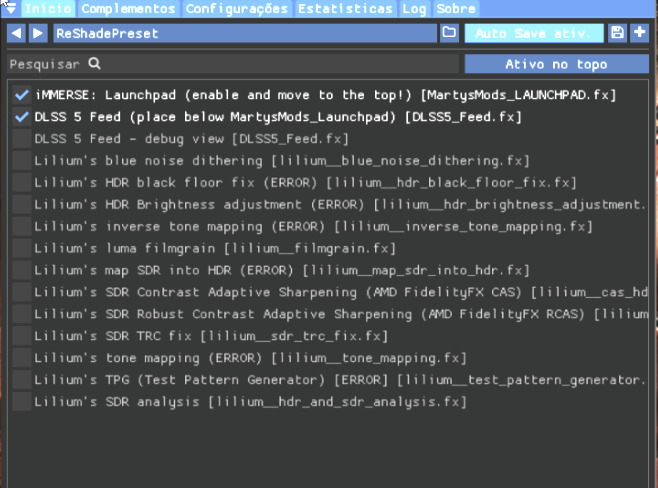
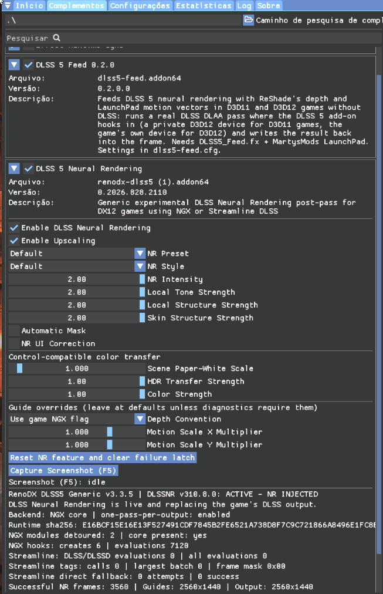

# Metal Gear Solid 4

## Status

The manual setup was confirmed working on August 30, 2026. The manager profile is implemented, with installation and removal testing still pending.

- Executable: `mgs4.exe`
- Profile status: first verified target
- Feeder version: v0.1.0

The test occurred before DLSS5-Feeder v0.2.0 was published. The MGS4 profile must therefore remain pinned to v0.1.0 until v0.2.0 is tested on the same installation.

## Required layout

```text
<game-dir>/
├── mgs4.exe
├── dxgi.dll
├── dlss5-feed.addon64
├── renodx-dlss5 (1).addon64
├── nvngx_dlss.dll
├── nvngx_dlssnr.dll
└── reshade-shaders/
    ├── Shaders/
    │   ├── DLSS5_Feed.fx
    │   ├── MartysMods_LAUNCHPAD.fx
    │   └── MartysMods/
    └── Textures/
        └── iMMERSE_bluenoise_opt.png
```

ReShade creates its own configuration and log files. DLSS5-Feeder creates `dlss5-feed.cfg` and `dlss5-feed.log`.

The working installation screenshot shows the required feeder, RenoDX, LaunchPad, shader, and texture files. The `Lilium` folders and unrelated ReShade shaders visible in the screenshots are not DLSS5-Feeder requirements.

The working setup uses `renodx-dlss5 (1).addon64`. The `(1)` suffix was added by Windows after a duplicate download and does not need to be removed. The manager must preserve the selected add-on filename.

## Manual procedure

1. Install ReShade with add-on support for Direct3D 10/11/12.
2. Place `dlss5-feed.addon64` next to the game executable.
3. Place `DLSS5_Feed.fx` in `reshade-shaders/Shaders`.
4. Download iMMERSE with Code > Download ZIP. The LaunchPad shader is usually at `iMMERSE-main/Shaders/MartysMods_LAUNCHPAD.fx` after extraction.
5. Copy `MartysMods_LAUNCHPAD.fx` and the complete `MartysMods` folder into `reshade-shaders/Shaders`.
6. Copy `iMMERSE_bluenoise_opt.png` into `reshade-shaders/Textures`.
7. Place the selected RenoDX add-on, `nvngx_dlssnr.dll`, and `nvngx_dlss.dll` next to the game executable without renaming them. RHI 2.4.4 or newer can obtain the add-on and deploy `nvngx_dlssnr.dll`.
8. On the ReShade Home tab, enable `iMMERSE: Launchpad` and move it above `DLSS 5 Feed`.
9. On the Add-ons tab, enable `DLSS 5 Feed` and `DLSS 5 Neural Rendering`.
10. In the `DLSS 5 Neural Rendering` panel, enable `Enable DLSS Neural Rendering` and `Enable Upscaling`.
11. Keep MSAA and SSAA disabled.

## ReShade settings

The Home tab must keep LaunchPad above the feeder:



The Add-ons tab must have both add-ons and the two neural-rendering options enabled:



## Validation

A successful run must contain:

- `feature ready ... DLAA` and `frame N delivered` in `dlss5-feed.log`;
- `feature 18 created` and `inline feature 18 evaluation succeeded` in `ReShade.log`.

The presence of files alone is not sufficient to mark the profile as working.

## Sources

- [DLSS5-Feeder](https://github.com/jlrouzies-fr/DLSS5-Feeder)
- [DLSS5-Feeder v0.1.0](https://github.com/jlrouzies-fr/DLSS5-Feeder/releases/tag/v0.1.0)
- [iMMERSE](https://github.com/martymcmodding/iMMERSE)
- [RHI](https://github.com/RankFTW/RHI/releases)

## Pinned feeder files

| File | SHA-256 |
| --- | --- |
| `dlss5-feed.addon64` | `6ea59b3237ed9f1e2bdc6e258518347ccb7e03dfdc2f96fc08addc8974527dad` |
| `DLSS5_Feed.fx` | `2dca9659c9e44ab05d29b2ebf20c5d6414c6de8b57f506bf4d52fa9c556a8943` |

DLSS5-Feeder is MIT-licensed. Other components retain their own licenses and are not bundled.
